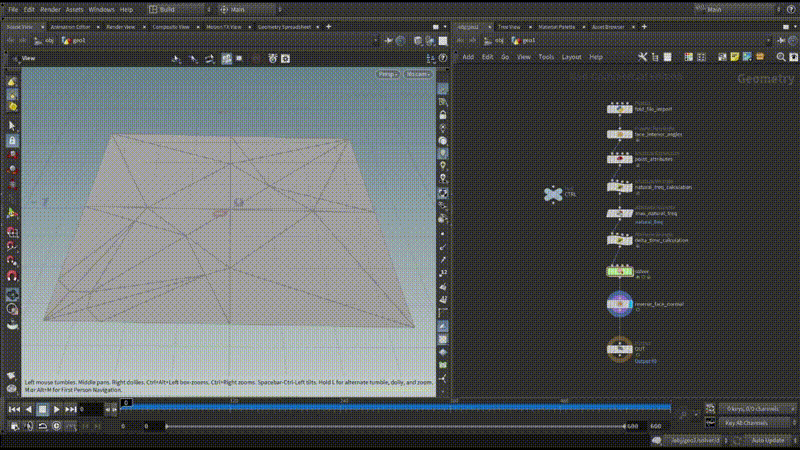

houdini-origami-simulator
===

This is a remake of [OrigamiSimulator](https://origamisimulator.org/) by Houdini.

Notes:
- Supported file formats to import is only [FOLD](https://github.com/edemaine/fold).
- The Network assumes that faces of FOLD data have already been triangulated.

